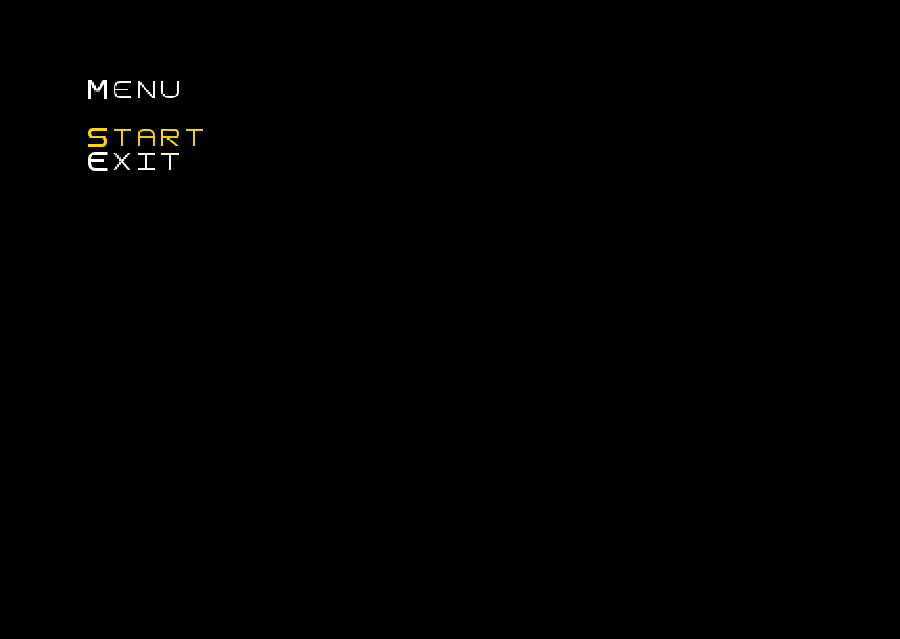
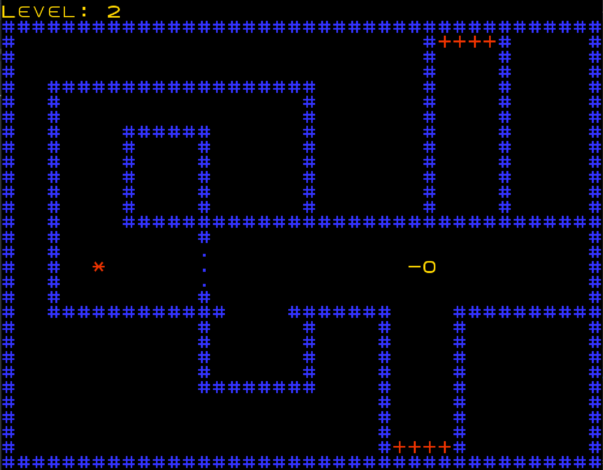
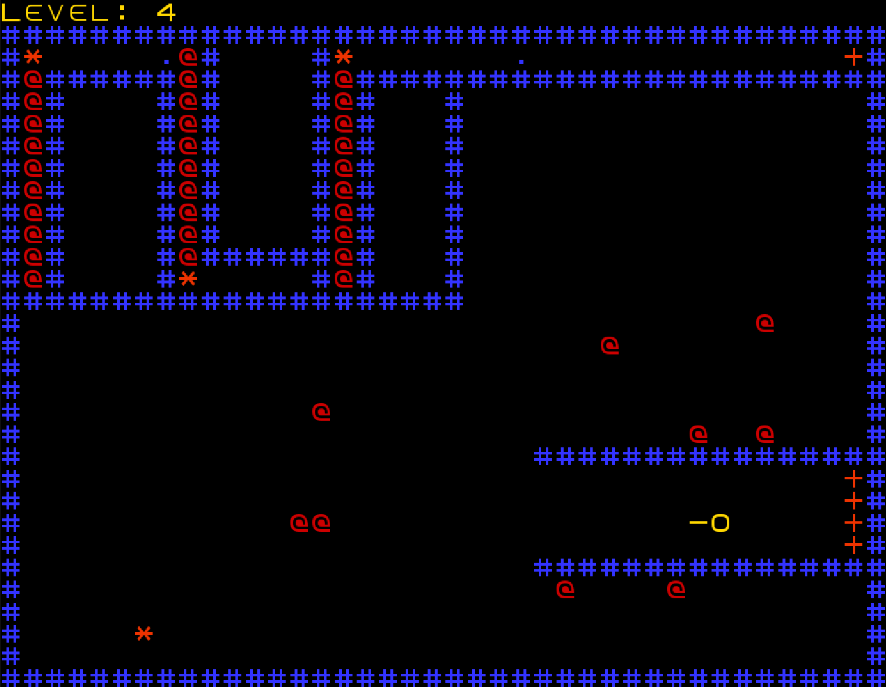
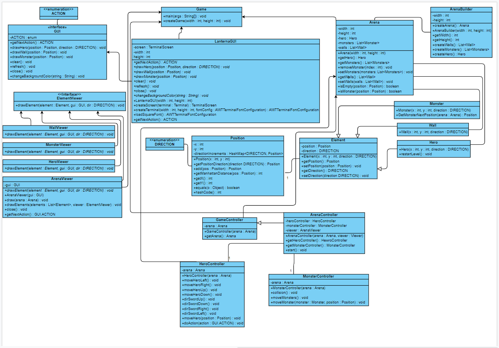
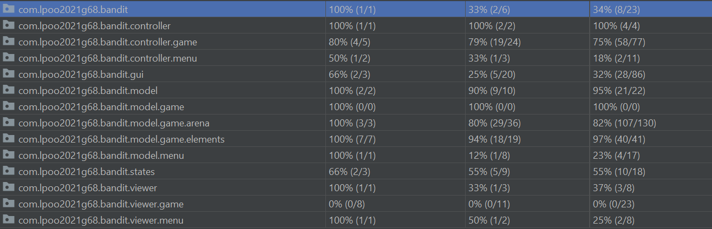
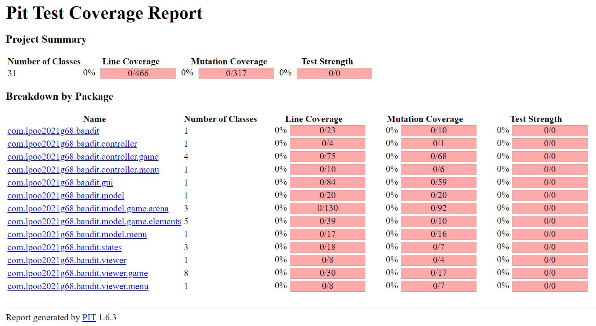

# LPOO_68 - Bandit, The Cat
In this game you will control Bandit, The Cat thru a series of levels where little out of control toys will come at you at all costs. Slay them all to reach the next stage and, 
eventually, your true destiny. But be warned, you can't just go rushing in, you will have to use your brain.
This project was developed by Daniela Aguiar (up201910371@fe.up.pt) and Jorge Costa (up201706518@fe.up.pt) for LPOO 2020⁄21.

## Implemented Features
We have implemented the following features:
- Start menu.
- The player can move and control his sword.
- Various levels (maps).
- The player takes damage when hit by an enemy (contact with body).
- The enemy dies and disappears when it comes in contact with the sword.
- The program can read maps from .txt files located in the resources folder.
- There's a switch that makes walls appear/disappear when pressed.
- Each level has a door that leads to the next level.

## Design
### Architectural Pattern
#### Problem in Context
It was necessary to make the decision of what foundation was the most approppriate to approach a project like this, so we could build 
upon it as it developed.

#### The Pattern
We decided to implement the MVC (Model–View–Controller) design pattern, a type of architectural pattern. 

#### Implementation

#### Consequences
This pattern has the following advantages:
- Ease of modification.
- High cohesion.
- Better testability.

## Known Code Smells And Refactoring Suggestions
### Dispensables:
Speculative Generality - Thinking ahead of the project, we set up/though of some methods that ended up not being implemented.

### Couplers:
Middle Man - In our Position class, we have a method (add) that is called by one other method (getPositionDirection). These methods could possibly be integrated so that 'add' 
can generate and return the result within itself.

### Bloaters:
Large Class - Our Arena class grew as we worked on the project, to the point where it became a bloated class. In this case, we could perhaps create a new interface, so we could then have a list of the operations and behaviors that the program can call.

### Object-Orientation Abusers:
Refused Bequest - In our abstract class State, we declare methods that are inherited by the classes GameState and MenuState, but aren't used by either of those classes.
In this case, we could perhaps extract all fields and methods needed by the subclass from the parent class, put them in a new subclass, and set both classes to inherit from it.

## Testing

## Self-evaluation
Daniela Aguiar: 40%
Jorge Costa: 60%
